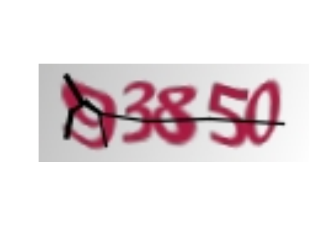
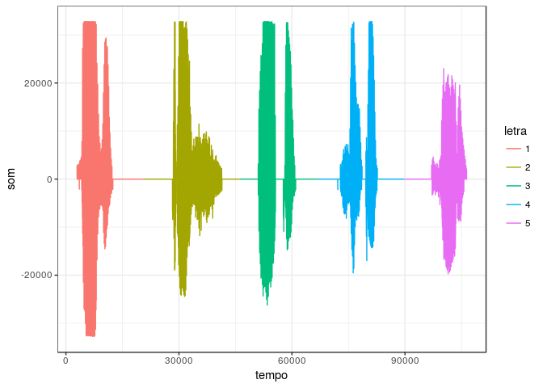

    knitr::opts_chunk$set(collapse = TRUE)

captchaTJMGAudio
================

Quebra captcha do TJMG por áudio.

Instalação
----------

    # install.packages('devtools')
    devtools::install_github('decryptr/captchaTJMGAudio')
    library(captchaTJMGAudio)

Download
--------

    path <- 'exemplo'

    captchaTJMGAudio::baixar_img_audio(path)

    arqs <- dir(path, full.names = TRUE)
    arqs
    ## [1] "exemplo/20170422134557736c6bcd9b64.jpg"
    ## [2] "exemplo/20170422134557736c6bcd9b64.wav"

Visualização
------------

Visualização da imagem do captcha.

    captchaTJMGAudio::desenhar_img(arqs[1])

Visualização do áudio picotado (cada cor é uma letra identificada)

    onda <- captchaTJMGAudio::ler_audio(arqs[2])
    captchaTJMGAudio::desenhar_corte(onda)

Predição
--------

    captchaTJMGAudio::predizer(arqs[2])
    ## [1] "93850"

Performance
-----------

    microbenchmark::microbenchmark(captcha = captchaTJMGAudio::predizer(arqs[2]))
    ## Unit: milliseconds
    ##     expr     min       lq     mean   median      uq      max neval
    ##  captcha 226.023 231.8543 266.3574 236.1673 247.043 388.0232   100
